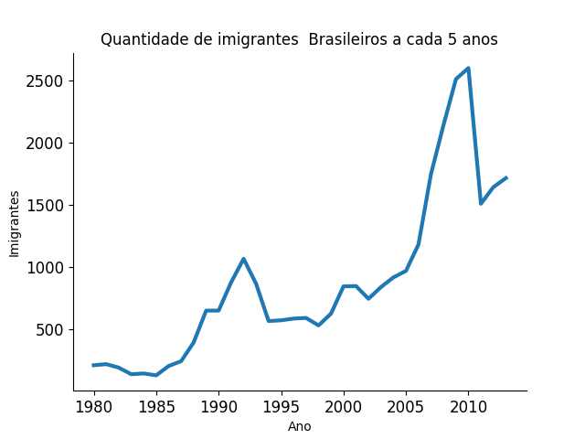
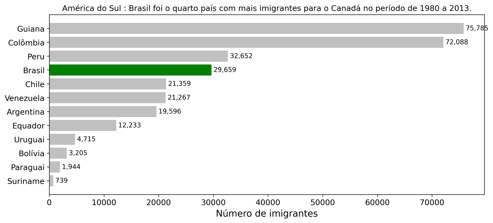

# 📊 Análise de Imigração Brasileira para o Canadá

> Projeto de análise e visualização de dados sobre a imigração de brasileiros e sul-americanos para o Canadá entre os anos de 1980 e 2013, utilizando Python e Matplotlib.

---

## 📌 Sobre o Projeto

Este projeto foi desenvolvido como parte da disciplina de **Ciência de Dados**, com foco no aprendizado da biblioteca **Matplotlib** para criação de visualizações de dados. A análise explora o dataset `imigrantes_canada.csv`, extraindo insights sobre o fluxo migratório brasileiro e sul-americano em direção ao Canadá ao longo de mais de três décadas.

### 🔍 Principais análises realizadas

- Evolução anual do número de imigrantes brasileiros para o Canadá (1980–2013)
- Comparativo entre países da América do Sul no total de imigrantes para o Canadá no mesmo período

---

## 📈 Visualizações Geradas

### 1. Evolução de Imigrantes Brasileiros (a cada 5 anos)



> O gráfico revela um crescimento expressivo na emigração brasileira a partir de 2005, com um pico histórico em torno de 2010, superando 2.500 imigrantes no período.

---

### 2. Ranking de Imigrantes da América do Sul para o Canadá (1980–2013)



> O Brasil ocupou a **4ª posição** entre os países sul-americanos com mais imigrantes para o Canadá no período, com **29.659** registros — atrás apenas de Guiana (75.785), Colômbia (72.088) e Peru (32.652).

---

## 🗂️ Estrutura do Projeto

```
📁 projeto-imigracao-canada/
├── 📁 imagens/
│   ├── quantidade_de_imigrante_brasileiro.png
│   └── imigracao_america_do_sul.png
├── imigrantes_canada.csv
├── analise_de_imigrantes_brasileiros.ipynb
└── README.md
```

---

## 🛠️ Tecnologias Utilizadas

| Biblioteca    | Versão   | Finalidade                              |
|---------------|----------|-----------------------------------------|
| `pandas`      | 2.3.0    | Manipulação e tratamento dos dados      |
| `matplotlib`  | 3.10.3   | Criação dos gráficos e visualizações    |
| `seaborn`     | 0.13.2   | Suporte a visualizações estatísticas    |
| `plotly`      | 6.2.0    | Visualizações interativas               |
| `ipykernel`   | 6.29.5   | Execução de notebooks Jupyter/Colab     |

---

## ⚙️ Como Executar

### Pré-requisitos

- Python 3.8+
- pip

### Instalação das dependências

```bash
pip install pandas==2.3.0 matplotlib==3.10.3 seaborn==0.13.2 plotly==6.2.0 ipykernel==6.29.5
```

Ou, se preferir instalar via arquivo de requisitos:

```bash
pip install -r requirements.txt
```

### Executando o notebook

1. Clone ou baixe o repositório
2. Certifique-se de que o arquivo `imigrantes_canada.csv` está na raiz do projeto
3. Abra o notebook `analise_de_imigrantes_brasileiros.ipynb` no **Jupyter Notebook**, **JupyterLab** ou **Google Colab**
4. Execute as células em ordem sequencial

> 💡 **Dica:** A pasta `imagens/` deve existir antes de executar o notebook, pois os gráficos são salvos automaticamente nela.

---

## 📋 Etapas da Análise

1. **Carregamento dos dados** — leitura do CSV com `pandas`
2. **Tratamento dos dados** — definição do índice por país e filtragem dos anos de interesse
3. **Extração da série brasileira** — isolamento dos dados do Brasil para análise temporal
4. **Visualização temporal** — gráfico de linha com a evolução de imigrantes brasileiros
5. **Visualização comparativa** — gráfico de barras horizontais com os países da América do Sul, destacando o Brasil em verde

---

## 📚 Contexto Acadêmico

- **Disciplina:** Ciência de Dados  
- **Tema:** Aula 1 — Conhecendo a biblioteca Matplotlib  
- **Dataset:** `imigrantes_canada.csv` — dados de imigração para o Canadá por país de origem


